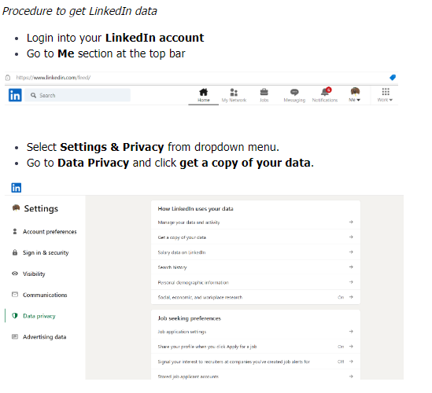
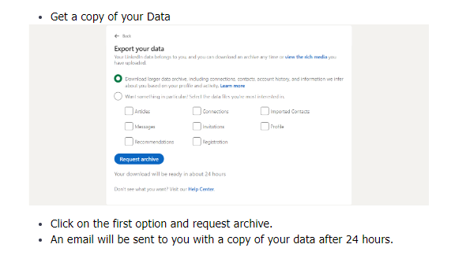
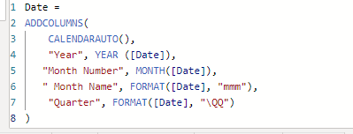
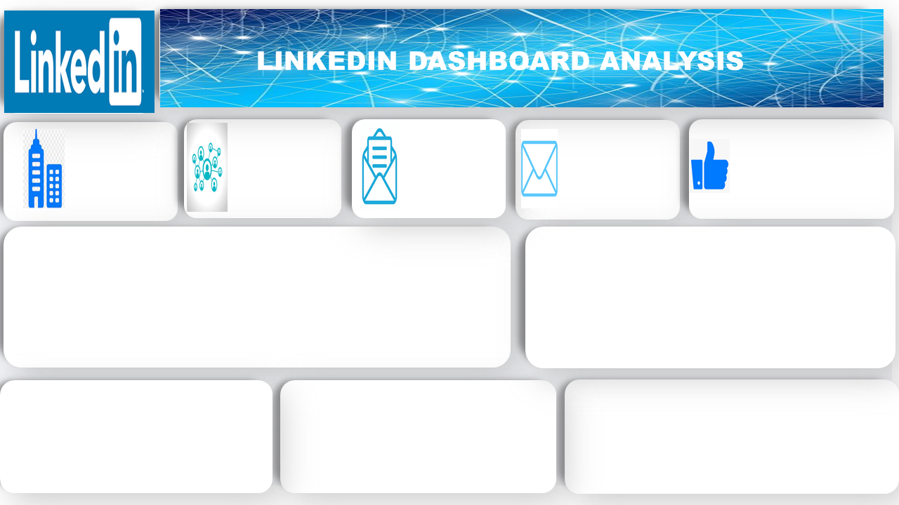
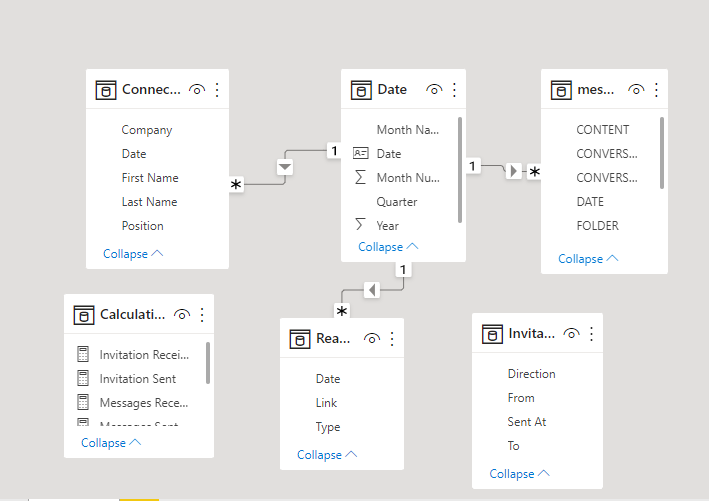
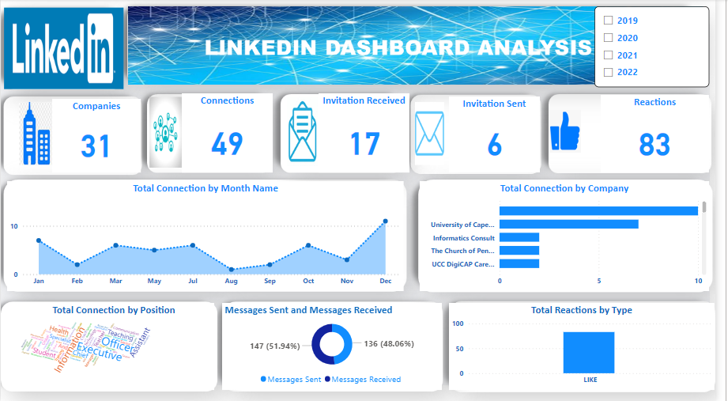

# LinkedIn Data Analysis

## Project Description ✨
I sought to analyze my linkedIn activities over some period of time using Power BI. I performed ETL (extract, transform and load) on the data.

## Procedure to get LinkedIn data

## Metrics to visualize ✍️
- Total companies
- Total connections
- Invitations received
- Invitations sent
- Total reactions
- Total connection by month name
- Total connection by company
- Total connection by position
- Messages sent and received
- Total reactions by type

# Data Visualization
i. Date table
 - A date table needs to be created in order to create a relationship diagram. 

ii. Canvas background designed with powerpoint

iii. Entity Relationship Diagram Model
- The various entities are related by date

iv. Overview of the dashboard

 ✍ Note: Find attached the Power BI online publishing link to interact with the whole thing.
 - [LinkedIn Dashboard](https://app.powerbi.com/groups/me/reports/ec6cda66-1b22-494f-ad4e-4d00b3eeb25e/ReportSection/)

